# SpenDiary - Design

| Student No | 22212013 |
| :---: | :---: |
| Name | 노현석 |
| E-Mail | nohhyun03@naver.com |

---

## Revision history

| Revision date | Version # | Description | Author |
| :---: | :---: | :--- | :---: |
| 2026-06-05 | 1.0.0 | first draft | Noh HyeonSeok |
| &nbsp; |  |  |  |
| &nbsp; |  |  |  |
| &nbsp; |  |  |  |

---

## Contents

- [Introduction](#1-introduction)
- [Class diagram](#2-class-diagram)
- [Sequence diagram](#3-sequence-diagram)
- [State machine diagram](#4-state-machine-diagram)
- [Implementation requirements](#5-implementation-requirements)
- [Glossary](#6-glossary)
- [References](#7-references)

---

## 1. Introduction

### 1) Summary
우리는 합리적인 소비 생활을 유지하기 위해 가계부를 작성한다. 하지만 단순히 수입과 지출 숫자만 기록하는 기존의 가계부 방식은, 지출 당시의 구체적인 상황이나 감정적 맥락을 담아내지 못해 소비 습관을 되돌아보는 데 한계가 있다. 또한, 단순히 통계만 제공하는 시스템은 사용자가 꾸준히 기록을 유지할 동기를 부여하기 어렵다.

이러한 한계를 해결하기 위해, 단순한 금액 관리를 넘어 소비에 얽힌 일상과 메모를 일기 형태로 함께 기록할 수 있는 통합 시스템 ‘SpenDiary(가계부 + 소비 일기)’를 고안하였다. 이 시스템을 통해 사용자는 직관적인 달력 UI 기반으로 한 달의 현금 흐름을 한눈에 파악할 수 있으며, 내역별 상세 메모와 카테고리별 통계를 통해 자신의 소비 패턴을 분석하고 개선할 수 있다.

이 문서는 ‘SpenDiary’를 개발하기 위한 Design(설계) 단계의 내용으로, 실제 구현에 필요한 백엔드 아키텍처와 데이터베이스 구조를 명시한다. 또한 도메인 클래스 다이어그램과 계층별 상호작용 다이어그램 등을 통해 객체 간의 연관 관계, 데이터의 흐름, 그리고 시스템의 전반적인 구조를 시각적으로 설명한다.

### 2) Important Points of Design
계층형 아키텍처 기반의 역할 분리: Controller, Service, Repository 계층을 명확히 분리하여 비즈니스 로직과 데이터 접근 로직의 결합도를 낮추고 유지보수성을 높인다.

객체지향 설계 원칙 반영: 엔티티의 속성은 private으로 선언하여 직접 접근을 제한하고, 필요한 범위에서 getter/setter를 통해 접근하도록 설계하였다. 또한 UML 연관 관계 표현 기준에 따라 클래스 간의 관계를 설계하였다.

세션 및 인터셉터 기반 인증 흐름 적용: 로그인 사용자를 세션으로 관리하고, 인터셉터를 통해 인증이 필요한 요청에 대한 접근을 제어한다.

[↑ Back to top](#spendiary---design)

---

## 2. Class Diagram
### 0. System Overview
프로젝트 전체 구조를 구성 요소별로 분리하여 나타낸다.

#### 0-1. Entity Overview
엔티티 관련 클래스 구조를 나타낸다.

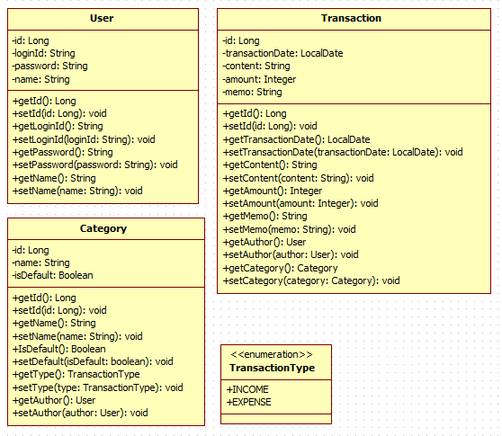

#### 0-2. DTO Overview
DTO 관련 클래스 구조를 나타낸다.

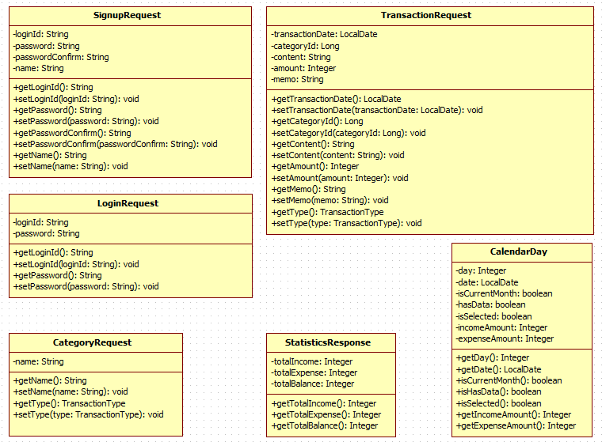

#### 0-3. MVC Overview
Controller, Service, Repository 계층 구조를 나타낸다.

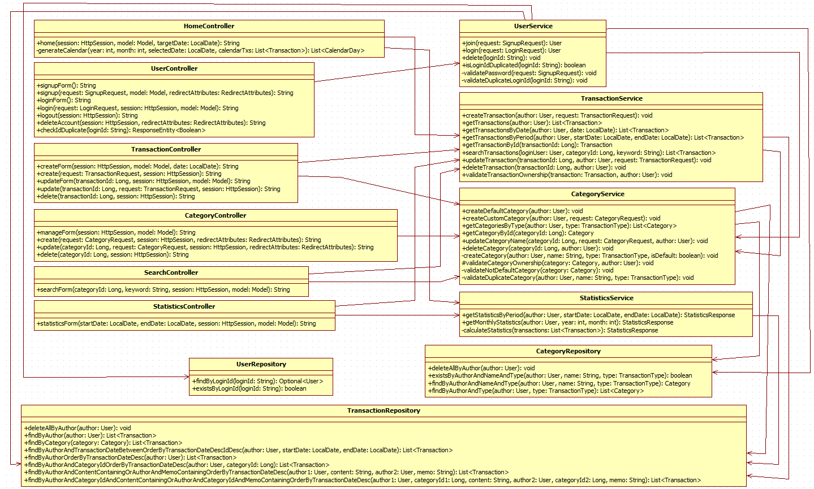

#### 0-4. Config Overview
애플리케이션 실행 및 설정 관련 구조를 나타낸다.

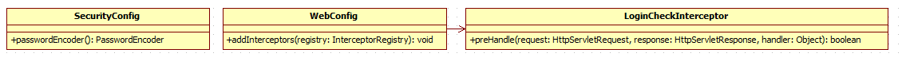

---

### 1. Domain Entity Model
엔티티들 간의 연관관계를 나타낸다.

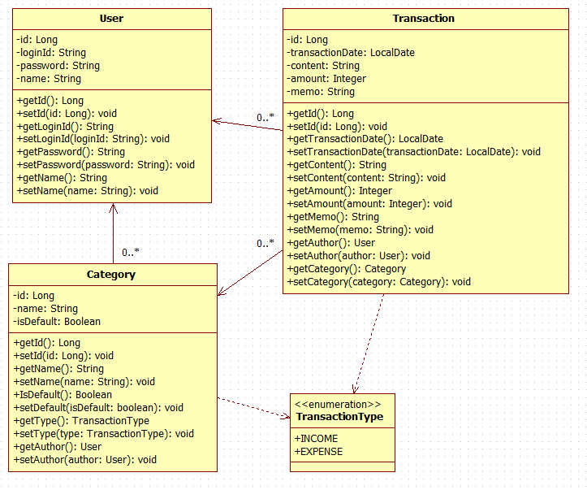

---

### 2. Controller-DTO Interaction
컨트롤러와 DTO 간의 입력 및 출력 데이터 의존 관계를 나타낸다.

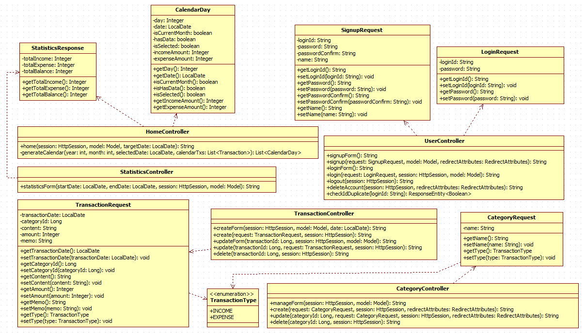

---

### 3. Controller-Service Interaction
컨트롤러와 서비스 간의 호출 관계를 나타낸다.

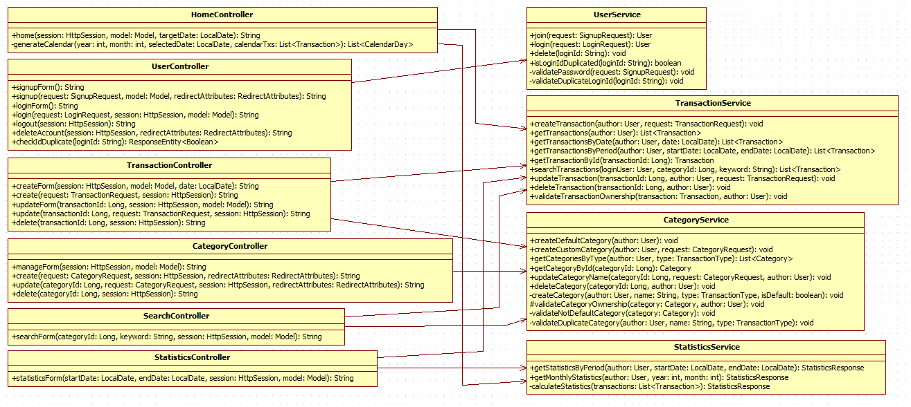

---

### 4. Service-Repository Interaction
서비스와 레포지토리 간의 데이터 접근 관계를 나타낸다.

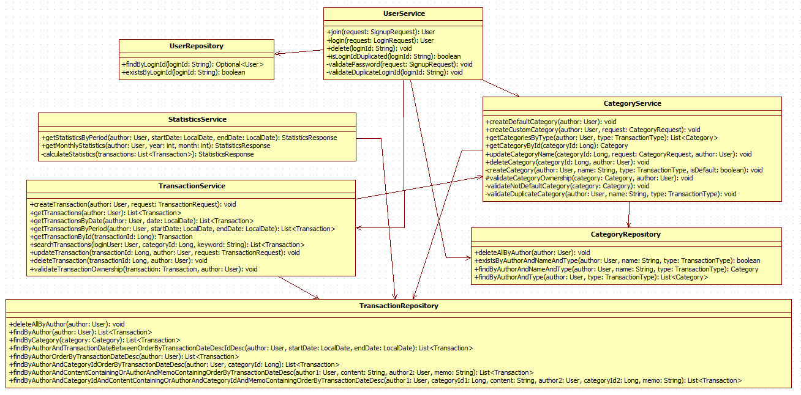

---

### 1) HomeController
| Attributes | Description |
| :--- | :--- |
| 없음 | 연결 관계는 클래스 다이어그램에서 표현 |

| Methods | Description |
| :--- | :--- |
| `+home(session: HttpSession, model: Model, targetDate: LocalDate): String` | 메인 홈 화면 요청을 처리하고 월별 통계, 선택 날짜 거래 내역, 달력 데이터를 모델에 담아 반환 |
| `-generateCalendar(year: int, month: int, selectedDate: LocalDate, calendarTxs: List<Transaction>): List<CalendarDay>` | 달력에 표시할 날짜별 수입/지출 정보를 생성 |

### 2) UserController
| Attributes | Description |
| :--- | :--- |
| 없음 | 연결 관계는 클래스 다이어그램에서 표현 |

| Methods | Description |
| :--- | :--- |
| `+signupForm(): String` | 회원가입 화면을 반환 |
| `+signup(request: SignupRequest, model: Model, redirectAttributes: RedirectAttributes): String` | 회원가입 요청을 처리 |
| `+loginForm(): String` | 로그인 화면을 반환 |
| `+login(request: LoginRequest, session: HttpSession, model: Model): String` | 로그인 요청을 처리하고 세션에 사용자 정보를 저장 |
| `+logout(session: HttpSession): String` | 로그아웃을 처리하고 세션을 종료 |
| `+deleteAccount(session: HttpSession, redirectAttributes: RedirectAttributes): String` | 회원 탈퇴를 처리 |
| `+checkIdDuplicate(loginId: String): ResponseEntity<Boolean>` | 아이디 중복 여부를 반환 |

### 3) TransactionController
| Attributes | Description |
| :--- | :--- |
| 없음 | 연결 관계는 클래스 다이어그램에서 표현 |

| Methods | Description |
| :--- | :--- |
| `+createForm(session: HttpSession, model: Model, date: LocalDate): String` | 거래 생성 화면을 반환 |
| `+create(request: TransactionRequest, session: HttpSession): String` | 거래 생성 요청을 처리 |
| `+updateForm(transactionId: Long, session: HttpSession, model: Model): String` | 거래 수정 화면을 반환 |
| `+update(transactionId: Long, request: TransactionRequest, session: HttpSession): String` | 거래 수정 요청을 처리 |
| `+delete(transactionId: Long, session: HttpSession): String` | 거래 삭제 요청을 처리 |

### 4) CategoryController
| Attributes | Description |
| :--- | :--- |
| 없음 | 연결 관계는 클래스 다이어그램에서 표현 |

| Methods | Description |
| :--- | :--- |
| `+manageForm(session: HttpSession, model: Model): String` | 카테고리 관리 화면을 반환 |
| `+create(request: CategoryRequest, session: HttpSession, redirectAttributes: RedirectAttributes): String` | 사용자 정의 카테고리 생성 요청을 처리 |
| `+update(categoryId: Long, request: CategoryRequest, session: HttpSession, redirectAttributes: RedirectAttributes): String` | 카테고리 수정 요청을 처리 |
| `+delete(categoryId: Long, session: HttpSession): String` | 카테고리 삭제 요청을 처리 |

### 5) SearchController
| Attributes | Description |
| :--- | :--- |
| 없음 | 연결 관계는 클래스 다이어그램에서 표현 |

| Methods | Description |
| :--- | :--- |
| `+searchForm(categoryId: Long, keyword: String, session: HttpSession, model: Model): String` | 카테고리 및 키워드 조건으로 거래 내역을 검색하고 검색 화면을 반환 |

### 6) StatisticsController
| Attributes | Description |
| :--- | :--- |
| 없음 | 연결 관계는 클래스 다이어그램에서 표현 |

| Methods | Description |
| :--- | :--- |
| `+statisticsForm(startDate: LocalDate, endDate: LocalDate, session: HttpSession, model: Model): String` | 기간별 통계와 거래 내역을 조회하여 통계 화면을 반환 |

---

### 7) UserService
| Attributes | Description |
| :--- | :--- |
| 없음 | 연결 관계는 클래스 다이어그램에서 표현 |

| Methods | Description |
| :--- | :--- |
| `+join(request: SignupRequest): User` | 회원가입을 처리하고 기본 카테고리를 생성 |
| `+login(request: LoginRequest): User` | 로그인 정보를 검증하고 사용자 정보를 반환 |
| `+delete(loginId: String): void` | 회원 탈퇴를 처리하고 관련 데이터까지 함께 삭제 |
| `+isLoginIdDuplicated(loginId: String): boolean` | 아이디 중복 여부를 반환 |
| `-validatePassword(request: SignupRequest): void` | 비밀번호와 비밀번호 확인값 일치 여부를 검증 |
| `-validateDuplicateLoginId(loginId: String): void` | 아이디 중복 여부를 검증 |

### 8) CategoryService
| Attributes | Description |
| :--- | :--- |
| 없음 | 연결 관계는 클래스 다이어그램에서 표현 |

| Methods | Description |
| :--- | :--- |
| `+createDefaultCategory(author: User): void` | 회원가입 시 기본 카테고리를 생성 |
| `+createCustomCategory(author: User, request: CategoryRequest): void` | 사용자 정의 카테고리를 생성 |
| `+getCategoriesByType(author: User, type: TransactionType): List<Category>` | 사용자와 타입 기준으로 카테고리 목록을 조회 |
| `+getCategoryById(categoryId: Long): Category` | 카테고리 ID로 카테고리를 조회 |
| `+updateCategoryName(categoryId: Long, request: CategoryRequest, author: User): void` | 카테고리 이름을 수정 |
| `+deleteCategory(categoryId: Long, author: User): void` | 카테고리를 삭제하고 관련 거래를 재분류 |
| `#validateCategoryOwnership(category: Category, author: User): void` | 카테고리 소유권을 검증 |
| `-createCategory(author: User, name: String, type: TransactionType, isDefault: boolean): void` | 카테고리 객체를 생성하고 저장 |
| `-validateNotDefaultCategory(category: Category): void` | 기본 카테고리인지 여부를 검증 |
| `-validateDuplicateCategory(author: User, name: String, type: TransactionType): void` | 카테고리명 중복 여부를 검증 |

### 9) TransactionService
| Attributes | Description |
| :--- | :--- |
| 없음 | 연결 관계는 클래스 다이어그램에서 표현 |

| Methods | Description |
| :--- | :--- |
| `+createTransaction(author: User, request: TransactionRequest): void` | 거래를 생성 |
| `+getTransactions(author: User): List<Transaction>` | 사용자의 전체 거래를 조회 |
| `+getTransactionsByDate(author: User, date: LocalDate): List<Transaction>` | 특정 날짜의 거래를 조회 |
| `+getTransactionsByPeriod(author: User, startDate: LocalDate, endDate: LocalDate): List<Transaction>` | 특정 기간의 거래를 조회 |
| `+getTransactionById(transactionId: Long): Transaction` | 거래 ID로 거래를 조회 |
| `+searchTransactions(loginUser: User, categoryId: Long, keyword: String): List<Transaction>` | 카테고리와 키워드 조건으로 거래를 검색 |
| `+updateTransaction(transactionId: Long, author: User, request: TransactionRequest): void` | 거래를 수정 |
| `+deleteTransaction(transactionId: Long, author: User): void` | 거래를 삭제 |
| `+validateTransactionOwnership(transaction: Transaction, author: User): void` | 거래 소유권을 검증 |

### 10) StatisticsService
| Attributes | Description |
| :--- | :--- |
| 없음 | 연결 관계는 클래스 다이어그램에서 표현 |

| Methods | Description |
| :--- | :--- |
| `+getStatisticsByPeriod(author: User, startDate: LocalDate, endDate: LocalDate): StatisticsResponse` | 특정 기간의 통계를 계산하여 반환 |
| `+getMonthlyStatistics(author: User, year: int, month: int): StatisticsResponse` | 특정 월의 통계를 계산하여 반환 |
| `-calculateStatistics(transactions: List<Transaction>): StatisticsResponse` | 거래 목록을 기반으로 수입, 지출, 잔액을 계산 |

---

### 11) UserRepository
| Attributes | Description |
| :--- | :--- |
| 없음 | 인터페이스이므로 별도 속성 없음 |

| Methods | Description |
| :--- | :--- |
| `+findByLoginId(loginId: String): Optional<User>` | 로그인 아이디로 사용자를 조회 |
| `+existsByLoginId(loginId: String): boolean` | 로그인 아이디 중복 여부를 확인 |

### 12) CategoryRepository
| Attributes | Description |
| :--- | :--- |
| 없음 | 인터페이스이므로 별도 속성 없음 |

| Methods | Description |
| :--- | :--- |
| `+deleteAllByAuthor(author: User): void` | 특정 사용자의 카테고리를 모두 삭제 |
| `+existsByAuthorAndNameAndType(author: User, name: String, type: TransactionType): boolean` | 사용자, 이름, 타입 기준으로 카테고리 중복 여부를 확인 |
| `+findByAuthorAndNameAndType(author: User, name: String, type: TransactionType): Category` | 사용자, 이름, 타입 기준으로 카테고리를 조회 |
| `+findByAuthorAndType(author: User, type: TransactionType): List<Category>` | 사용자와 타입 기준으로 카테고리 목록을 조회 |

### 13) TransactionRepository
| Attributes | Description |
| :--- | :--- |
| 없음 | 인터페이스이므로 별도 속성 없음 |

| Methods | Description |
| :--- | :--- |
| `+deleteAllByAuthor(author: User): void` | 특정 사용자의 거래를 모두 삭제 |
| `+findByAuthor(author: User): List<Transaction>` | 특정 사용자의 전체 거래를 조회 |
| `+findByCategory(category: Category): List<Transaction>` | 특정 카테고리에 속한 거래를 조회 |
| `+findByAuthorAndTransactionDateBetweenOrderByTransactionDateDescIdDesc(author: User, startDate: LocalDate, endDate: LocalDate): List<Transaction>` | 특정 기간의 거래를 최신순으로 조회 |
| `+findByAuthorOrderByTransactionDateDesc(author: User): List<Transaction>` | 사용자의 전체 거래를 날짜 기준 내림차순으로 조회 |
| `+findByAuthorAndCategoryIdOrderByTransactionDateDesc(author: User, categoryId: Long): List<Transaction>` | 특정 카테고리의 거래를 날짜 기준 내림차순으로 조회 |
| `+findByAuthorAndContentContainingOrAuthorAndMemoContainingOrderByTransactionDateDesc(author1: User, content: String, author2: User, memo: String): List<Transaction>` | 내용 또는 메모에 키워드가 포함된 거래를 조회 |
| `+findByAuthorAndCategoryIdAndContentContainingOrAuthorAndCategoryIdAndMemoContainingOrderByTransactionDateDesc(author1: User, categoryId1: Long, content: String, author2: User, categoryId2: Long, memo: String):List<Transaction>` | 카테고리와 키워드 조건을 함께 만족하는 거래를 조회 |

---

### 14) User
| Attributes | Description |
| :--- | :--- |
| `-id: Long` | 사용자 식별자 |
| `-loginId: String` | 로그인 아이디 |
| `-password: String` | 암호화된 비밀번호 |
| `-name: String` | 사용자 이름 |

| Methods | Description |
| :--- | :--- |
| `+getId(): Long` | 사용자 식별자를 반환 |
| `+getLoginId(): String` | 로그인 아이디를 반환 |
| `+getPassword(): String` | 암호화된 비밀번호를 반환 |
| `+getName(): String` | 사용자 이름을 반환 |

### 15) Category
| Attributes | Description |
| :--- | :--- |
| `-id: Long` | 카테고리 식별자 |
| `-name: String` | 카테고리명 |
| `-isDefault: Boolean` | 기본 카테고리 여부 |

| Methods | Description |
| :--- | :--- |
| `+getId(): Long` | 카테고리 식별자를 반환 |
| `+setId(id: Long): void` | 카테고리 식별자를 설정 |
| `+getName(): String` | 카테고리명을 반환 |
| `+setName(name: String): void` | 카테고리명을 설정 |
| `+getType(): TransactionType` | 카테고리 유형을 반환 |
| `+setType(type: TransactionType): void` | 카테고리 유형을 설정 |
| `+getIsDefault(): Boolean` | 기본 카테고리 여부를 반환 |
| `+setIsDefault(isDefault: Boolean): void` | 기본 카테고리 여부를 설정 |
| `+getAuthor(): User` | 카테고리 작성자를 반환 |
| `+setAuthor(author: User): void` | 카테고리 작성자를 설정 |

### 16) Transaction
| Attributes | Description |
| :--- | :--- |
| `-id: Long` | 거래 식별자 |
| `-transactionDate: LocalDate` | 거래 날짜 |
| `-content: String` | 거래 내용 |
| `-amount: Integer` | 거래 금액 |
| `-memo: String` | 거래 메모 |

| Methods | Description |
| :--- | :--- |
| `+getId(): Long` | 거래 식별자를 반환 |
| `+setId(id: Long): void` | 거래 식별자를 설정 |
| `+getType(): TransactionType` | 거래 유형을 반환 |
| `+setType(type: TransactionType): void` | 거래 유형을 설정 |
| `+getTransactionDate(): LocalDate` | 거래 날짜를 반환 |
| `+setTransactionDate(transactionDate: LocalDate): void` | 거래 날짜를 설정 |
| `+getContent(): String` | 거래 내용을 반환 |
| `+setContent(content: String): void` | 거래 내용을 설정 |
| `+getAmount(): Integer` | 거래 금액을 반환 |
| `+setAmount(amount: Integer): void` | 거래 금액을 설정 |
| `+getMemo(): String` | 거래 메모를 반환 |
| `+setMemo(memo: String): void` | 거래 메모를 설정 |
| `+getAuthor(): User` | 거래 작성자를 반환 |
| `+setAuthor(author: User): void` | 거래 작성자를 설정 |
| `+getCategory(): Category` | 거래 카테고리를 반환 |
| `+setCategory(category: Category): void` | 거래 카테고리를 설정 |

### 17) TransactionType
| Attributes | Description |
| :--- | :--- |
| `INCOME` | 수입 거래 유형 |
| `EXPENSE` | 지출 거래 유형 |

| Methods | Description |
| :--- | :--- |
| 없음 | 열거형이므로 별도 메서드 설명 생략 |

---

### 18) LoginRequest
| Attributes | Description |
| :--- | :--- |
| `-loginId: String` | 로그인 요청 아이디 |
| `-password: String` | 로그인 요청 비밀번호 |

| Methods | Description |
| :--- | :--- |
| `+getLoginId(): String` | 로그인 아이디를 반환 |
| `+setLoginId(loginId: String): void` | 로그인 아이디를 설정 |
| `+getPassword(): String` | 비밀번호를 반환 |
| `+setPassword(password: String): void` | 비밀번호를 설정 |

### 19) SignupRequest
| Attributes | Description |
| :--- | :--- |
| `-loginId: String` | 회원가입 아이디 |
| `-password: String` | 회원가입 비밀번호 |
| `-passwordConfirm: String` | 비밀번호 확인값 |
| `-name: String` | 회원 이름 |

| Methods | Description |
| :--- | :--- |
| `+getLoginId(): String` | 회원가입 아이디를 반환 |
| `+setLoginId(loginId: String): void` | 회원가입 아이디를 설정 |
| `+getPassword(): String` | 비밀번호를 반환 |
| `+setPassword(password: String): void` | 비밀번호를 설정 |
| `+getPasswordConfirm(): String` | 비밀번호 확인값을 반환 |
| `+setPasswordConfirm(passwordConfirm: String): void` | 비밀번호 확인값을 설정 |
| `+getName(): String` | 회원 이름을 반환 |
| `+setName(name: String): void` | 회원 이름을 설정 |

### 20) CategoryRequest
| Attributes | Description |
| :--- | :--- |
| `-name: String` | 카테고리명 |
| `-type: TransactionType` | 카테고리 유형 |

| Methods | Description |
| :--- | :--- |
| `+getName(): String` | 카테고리명을 반환 |
| `+setName(name: String): void` | 카테고리명을 설정 |
| `+getType(): TransactionType` | 카테고리 유형을 반환 |
| `+setType(type: TransactionType): void` | 카테고리 유형을 설정 |

### 21) TransactionRequest
| Attributes | Description |
| :--- | :--- |
| `-type: TransactionType` | 거래 유형 |
| `-transactionDate: LocalDate` | 거래 날짜 |
| `-categoryId: Long` | 선택한 카테고리 ID |
| `-content: String` | 거래 내용 |
| `-amount: Integer` | 거래 금액 |
| `-memo: String` | 거래 메모 |

| Methods | Description |
| :--- | :--- |
| `+getType(): TransactionType` | 거래 유형을 반환 |
| `+setType(type: TransactionType): void` | 거래 유형을 설정 |
| `+getTransactionDate(): LocalDate` | 거래 날짜를 반환 |
| `+setTransactionDate(transactionDate: LocalDate): void` | 거래 날짜를 설정 |
| `+getCategoryId(): Long` | 카테고리 ID를 반환 |
| `+setCategoryId(categoryId: Long): void` | 카테고리 ID를 설정 |
| `+getContent(): String` | 거래 내용을 반환 |
| `+setContent(content: String): void` | 거래 내용을 설정 |
| `+getAmount(): Integer` | 거래 금액을 반환 |
| `+setAmount(amount: Integer): void` | 거래 금액을 설정 |
| `+getMemo(): String` | 거래 메모를 반환 |
| `+setMemo(memo: String): void` | 거래 메모를 설정 |

### 22) StatisticsResponse
| Attributes | Description |
| :--- | :--- |
| `-totalIncome: Integer` | 총 수입 |
| `-totalExpense: Integer` | 총 지출 |
| `-totalBalance: Integer` | 총 잔액 |

| Methods | Description |
| :--- | :--- |
| `+getTotalIncome(): Integer` | 총 수입을 반환 |
| `+getTotalExpense(): Integer` | 총 지출을 반환 |
| `+getTotalBalance(): Integer` | 총 잔액을 반환 |

### 23) CalendarDay
| Attributes | Description |
| :--- | :--- |
| `-day: Integer` | 달력에 표시되는 일자 |
| `-date: LocalDate` | 실제 날짜 객체 |
| `-isCurrentMonth: boolean` | 현재 달에 속하는 날짜인지 여부 |
| `-hasData: boolean` | 해당 날짜에 거래 데이터가 존재하는지 여부 |
| `-isSelected: boolean` | 현재 사용자가 선택한 날짜인지 여부 |
| `-incomeAmount: Integer` | 해당 날짜의 총 수입 |
| `-expenseAmount: Integer` | 해당 날짜의 총 지출 |

| Methods | Description |
| :--- | :--- |
| `+getDay(): Integer` | 표시 일자를 반환 |
| `+getDate(): LocalDate` | 날짜 객체를 반환 |
| `+isCurrentMonth(): boolean` | 현재 달 소속 여부를 반환 |
| `+isSelected(): boolean` | 선택된 날짜 여부를 반환 |
| `+getIncomeAmount(): Integer` | 해당 날짜 총 수입을 반환 |
| `+getExpenseAmount(): Integer` | 해당 날짜 총 지출을 반환 |

---

### 24) SecurityConfig
| Attributes | Description |
| :--- | :--- |
| 없음 | 설정 클래스이므로 별도 속성 없음 |

| Methods | Description |
| :--- | :--- |
| `+passwordEncoder(): PasswordEncoder` | 비밀번호 암호화를 위한 PasswordEncoder 빈을 등록 |

### 25) WebConfig
| Attributes | Description |
| :--- | :--- |
| 없음 | 설정 클래스이므로 별도 속성 없음 |

| Methods | Description |
| :--- | :--- |
| `+addInterceptors(registry: InterceptorRegistry): void` | 로그인 체크 인터셉터를 등록 |

### 26) LoginCheckInterceptor
| Attributes | Description |
| :--- | :--- |
| 없음 | 세션 검사 로직만 담당 |

| Methods | Description |
| :--- | :--- |
| `+preHandle(request: HttpServletRequest, response: HttpServletResponse, handler: Object): boolean` | 요청 처리 전 로그인 여부를 검사하고 미로그인 시 로그인 페이지로 리다이렉트 |

[↑ Back to top](#spendiary---design)

---

## 3. Sequence Diagram

#### [Figure 3-1] Register Sequence Diagram

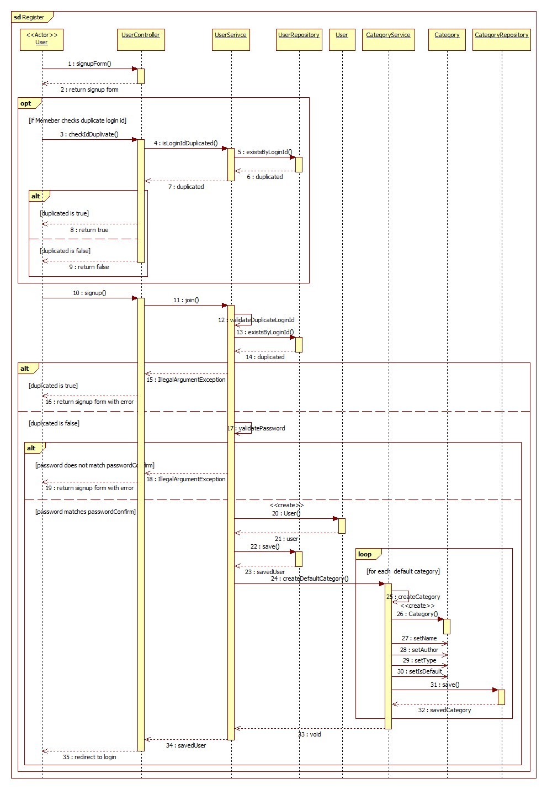

위의 그림은 회원가입 수행을 표현하는 Sequence diagram이다.
User가 회원가입 화면을 요청하면 UserController가 가입 페이지를 반환한다.
아이디 중복 확인을 수행하는 경우 UserService와 UserRepository를 통해 loginId의 중복 여부를 검사하고 결과를 반환한다.
회원가입 요청 시 중복 아이디와 비밀번호 확인 값을 검증한 뒤 User를 생성하여 저장하고, 가입한 사용자에게 기본 Category를 생성한 후 로그인 화면으로 이동한다.

---

#### [Figure 3-2] Login Sequence Diagram

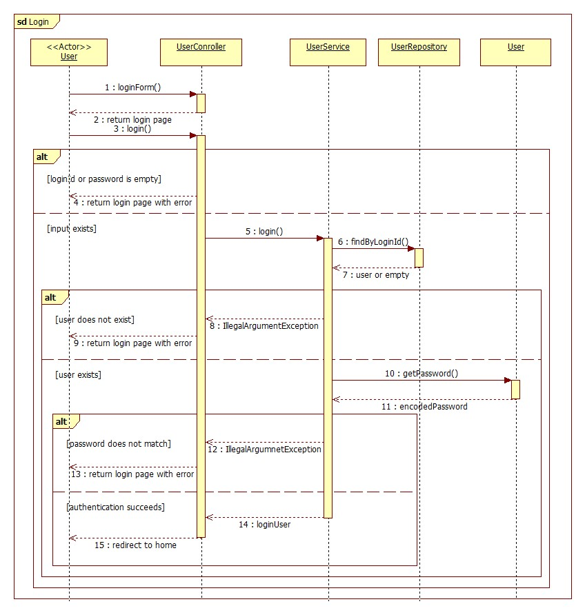

위의 그림은 로그인 수행을 표현하는 Sequence diagram이다.
User가 로그인 화면을 요청하면 UserController가 로그인 페이지를 반환한다.
로그인 요청 시 입력값이 비어 있으면 오류와 함께 로그인 페이지를 다시 보여주고, 입력값이 있으면 UserService가 UserRepository에서 loginId로 사용자를 조회한다.
사용자가 없거나 비밀번호가 일치하지 않으면 오류를 반환하고, 인증에 성공하면 로그인 사용자를 세션에 저장한 뒤 홈 화면으로 이동한다.

---

#### [Figure 3-3] Logout Sequence Diagram

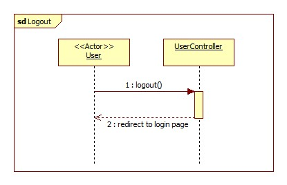

위의 그림은 로그아웃 수행을 표현하는 Sequence diagram이다.
User가 logout을 요청하면 UserController가 현재 로그인 상태를 종료한다.
처리가 끝나면 User를 로그인 화면으로 이동시킨다.

---

#### [Figure 3-4] Create Income Transaction Sequence Diagram
#### [Figure 3-5] Create Expense Transaction Sequence Diagram

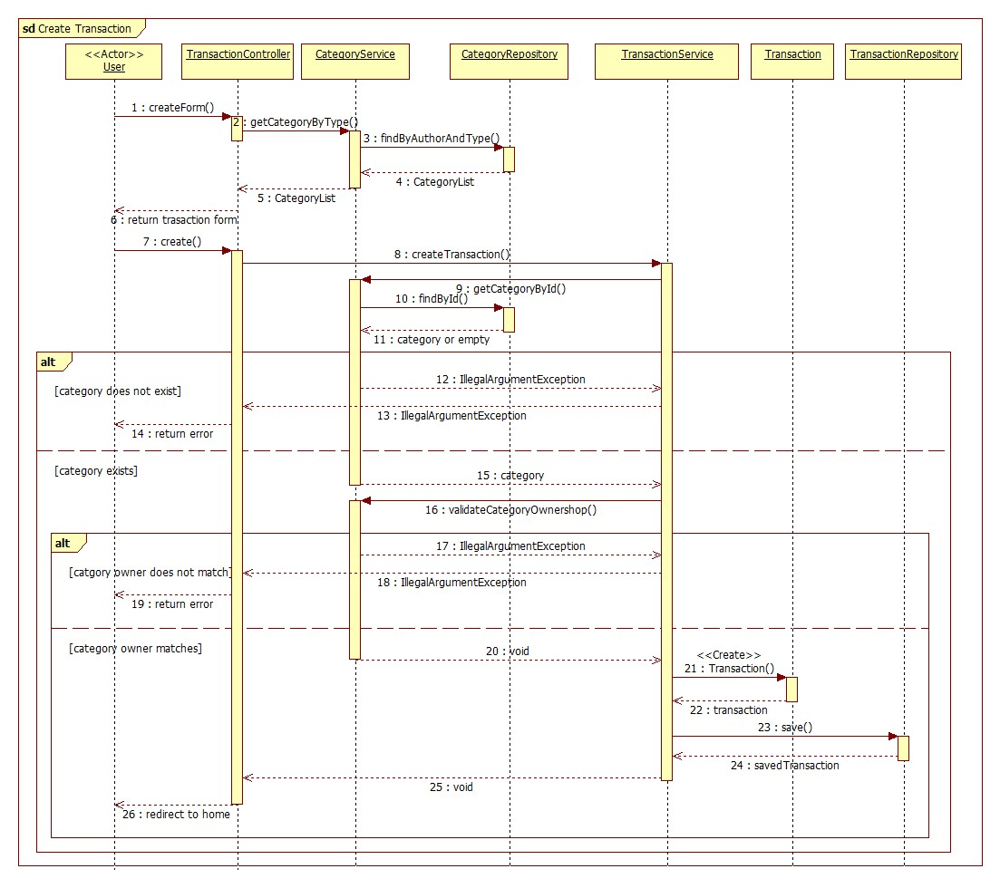

위의 그림은 수입 및 지출 거래 등록 수행을 표현하는 Sequence diagram이다.
User가 거래 등록 화면을 요청하면 TransactionController가 CategoryService를 통해 카테고리 목록을 조회하고 거래 입력 화면을 반환한다.
거래 등록 요청이 들어오면 TransactionService가 선택한 Category를 조회하고 사용자 소유 여부를 검증한다.
카테고리가 존재하지 않거나 소유자가 일치하지 않으면 오류를 반환하고, 검증에 성공하면 Transaction을 생성하여 저장한 뒤 홈 화면으로 이동한다.
수입과 지출 거래 등록은 동일한 처리 흐름을 사용하며, request의 type 값만 INCOME 또는 EXPENSE로 달라지므로 하나의 다이어그램으로 통합하여 표현하였다.

---

#### [Figure 3-6] View Calendar With Monthly Summary Sequence Diagram
#### [Figure 3-7] View Daily Transactions By Selecting A Date Sequence Diagram

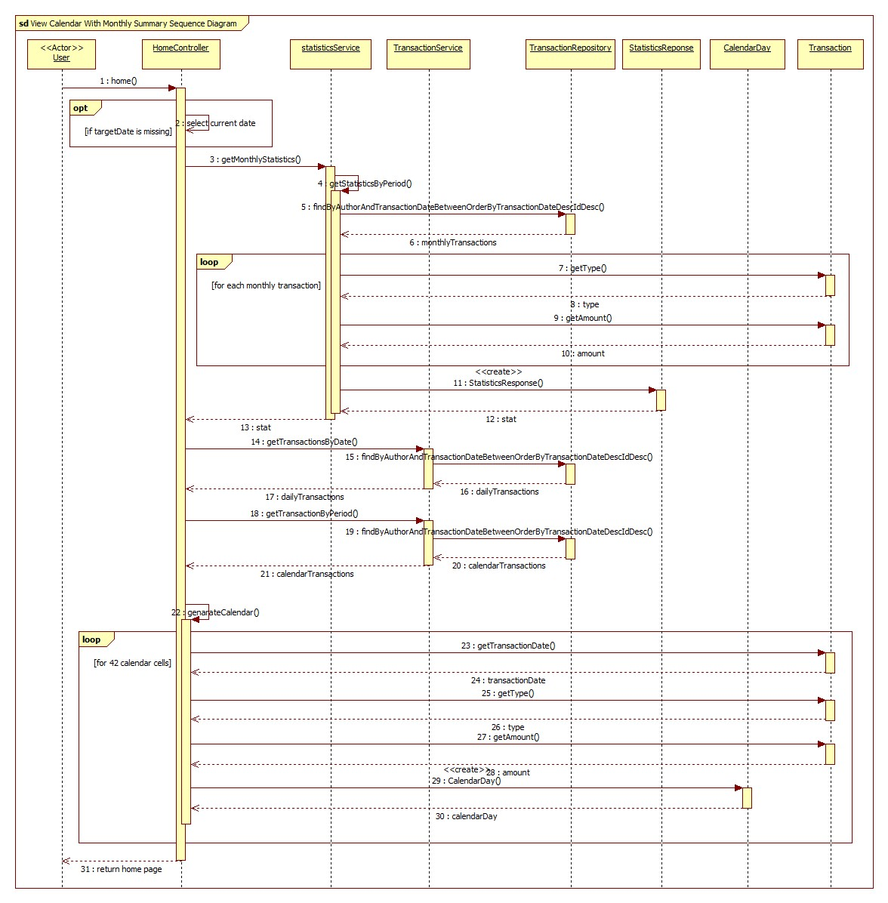

위의 그림은 홈 화면에서 월별 요약을 표현함과 동시에 달력에서 특정 날짜를 선택하여 일별 거래 내역을 조회하는 수행을 표현하는 Sequence diagram이다.
3-6와 3-7을 함께 표현하였다.
User가 홈 화면을 요청하면 HomeController는 targetDate가 없을 때 현재 날짜를 기준 날짜로 설정한다.
StatisticsService는 해당 월의 거래 내역을 조회하여 총수입, 총지출, 잔액을 계산하고 StatisticsResponse를 생성한다.
이후 TransactionService가 선택된 날짜의 거래와 달력 표시 기간의 거래를 조회하며, HomeController가 CalendarDay 목록을 생성하여 홈 화면을 반환한다. 이때 해당 날짜의 거래 내역이 함께 표시된다.

---

#### [Figure 3-8] View Transactions For A Specific Period With Summary Sequence Diagram

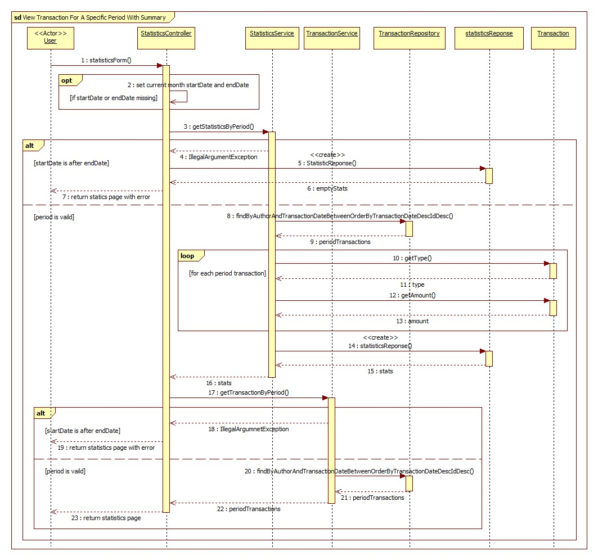

위의 그림은 특정 기간의 거래 내역과 통계를 조회하는 수행을 표현하는 Sequence diagram이다.
User가 통계 화면을 요청하면 StatisticsController는 시작일과 종료일이 없을 경우 현재 월의 시작일과 종료일을 기본값으로 설정한다.
StatisticsService는 기간이 올바른지 검증한 뒤 해당 기간의 거래를 조회하여 총수입, 총지출, 잔액을 계산한다.
기간이 잘못되면 오류와 빈 통계를 반환하고, 정상적인 기간이면 TransactionService가 기간 내 거래 목록을 조회하여 통계 화면을 반환한다.

---

#### [Figure 3-9] Update Transaction Sequence Diagram

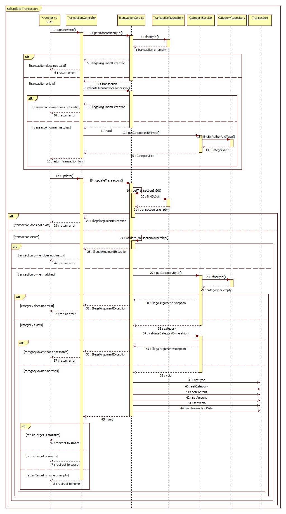

위의 그림은 거래 수정 수행을 표현하는 Sequence diagram이다.
User가 수정 화면을 요청하면 TransactionController가 TransactionService를 통해 거래를 조회하고 로그인 사용자 소유의 거래인지 검증한다.
검증에 성공하면 수입 및 지출 카테고리 목록을 조회하여 거래 수정 화면을 반환한다.
수정 요청 시에는 거래 존재 여부, 거래 소유자, 선택한 카테고리 존재 여부와 카테고리 소유자를 다시 검증한 뒤 Transaction의 타입, 카테고리, 내용, 금액, 메모, 날짜를 변경하고 요청 출처에 따라 홈, 통계, 검색 화면 중 하나로 이동한다.

---

#### [Figure 3-10] Delete Transaction Sequence Diagram

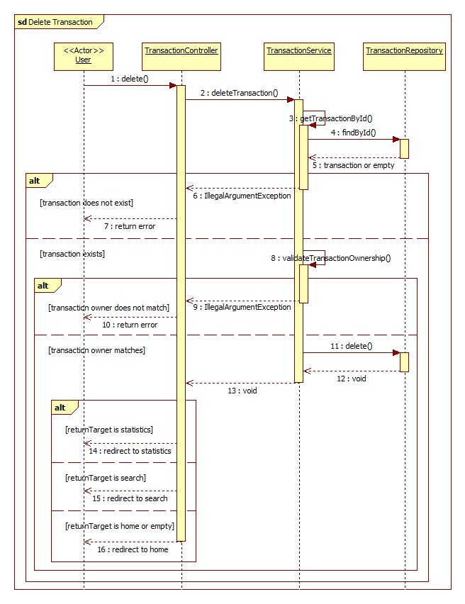

위의 그림은 거래 삭제 수행을 표현하는 Sequence diagram이다.
User가 삭제를 요청하면 TransactionController가 TransactionService에 거래 삭제를 요청한다.
TransactionService는 transactionId로 거래를 조회하고 로그인 사용자 소유의 거래인지 검증한다.
거래가 없거나 소유자가 일치하지 않으면 오류를 반환하고, 검증에 성공하면 TransactionRepository에서 거래를 삭제한 뒤 요청 출처에 따라 홈, 통계, 검색 화면 중 하나로 이동한다.

---

#### [Figure 3-11] Manage Categories Sequence Diagram

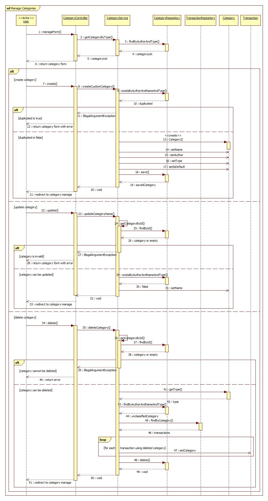

위의 그림은 카테고리 관리 수행을 표현하는 Sequence diagram이다.
User가 카테고리 관리 화면을 요청하면 CategoryController가 CategoryService를 통해 수입 및 지출 카테고리 목록을 조회하고 관리 화면을 반환한다.
카테고리 생성 시에는 같은 사용자, 이름, 타입의 중복 여부를 검사한 뒤 사용자 정의 Category를 저장한다.
카테고리 수정 시에는 카테고리 존재 여부와 수정 가능 여부를 검증하고 중복 이름이 없으면 이름을 변경한다.
카테고리 삭제 시에는 삭제 가능 여부를 확인한 뒤 해당 카테고리를 사용하던 Transaction의 카테고리를 미분류 카테고리로 변경하고 기존 Category를 삭제한다.

---

#### [Figure 3-12] Search Transactions Sequence Diagram

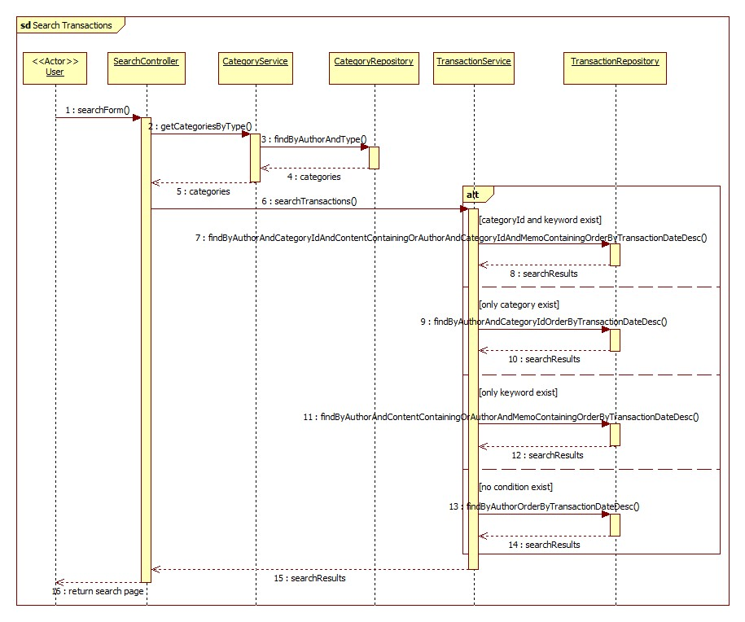

위의 그림은 거래 검색 수행을 표현하는 Sequence diagram이다.
User가 검색 화면을 요청하면 SearchController가 수입 및 지출 카테고리 목록을 조회한다.
이후 TransactionService가 categoryId와 keyword의 존재 여부에 따라 카테고리와 키워드 조건 검색, 카테고리 검색, 키워드 검색, 전체 검색 중 하나를 수행한다.
검색 결과를 SearchController에 반환하면 SearchController는 검색 화면에 결과를 표시한다.

[↑ Back to top](#spendiary---design)

---

## 4. State machine diagram

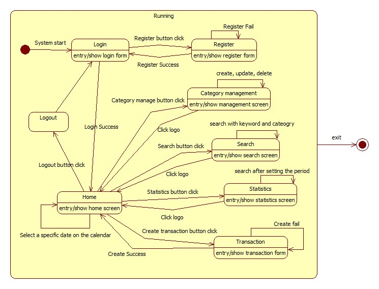

시스템이 실행되면 먼저 Login 화면이 나타난다. 사용자는 이 화면에서 로그인을 진행하거나, 아직 계정이 없는 경우 회원가입 버튼을 눌러 Register 화면으로 이동할 수 있다. 회원가입 화면에서는 필요한 정보를 입력해 가입을 진행하며, 입력값에 문제가 있거나 가입에 실패하면 Register 화면에 그대로 남아 다시 입력할 수 있다. 회원가입이 정상적으로 완료되면 다시 Login 화면으로 돌아가 로그인할 수 있도록 한다.

로그인이 성공하면 사용자는 Home 화면으로 이동한다. Home 화면은 Spendiary의 중심 화면으로, 사용자가 선택한 날짜의 수입과 지출 내역을 확인할 수 있다. 달력에서 특정 날짜를 선택하면 해당 날짜의 거래 내역이 다시 조회되어 Home 화면에 반영된다.

Home 화면에서 거래 생성 버튼을 누르면 Transaction 화면으로 이동한다. 이 화면에서는 수입 또는 지출 정보를 입력해 새로운 거래 내역을 등록한다. 등록이 성공하면 다시 Home 화면으로 돌아가 변경된 내역을 확인할 수 있고, 입력값이 올바르지 않거나 등록에 실패하면 Transaction 화면에 머무르며 내용을 수정해 다시 시도한다.

또한 Home 화면에서는 카테고리 관리 화면으로 이동할 수 있다. Category management 화면에서는 사용자가 수입과 지출 카테고리를 생성, 수정, 삭제할 수 있다. 작업을 마친 뒤 로고를 클릭하면 다시 Home 화면으로 돌아간다.

검색 기능을 사용하면 Search 화면으로 이동한다. 사용자는 키워드와 카테고리를 기준으로 거래 내역을 검색할 수 있으며, 검색 조건을 입력하면 조건에 맞는 결과가 화면에 표시된다. 검색 화면에서도 로고를 클릭하면 Home 화면으로 돌아갈 수 있다.

통계 버튼을 누르면 Statistics 화면으로 이동한다. 이 화면에서는 사용자가 원하는 기간을 설정해 해당 기간의 수입과 지출 통계를 확인할 수 있다. 기간 설정 후 조회를 수행하면 통계 결과가 화면에 표시되며, 로고를 클릭하면 다시 Home 화면으로 이동한다.

마지막으로 Home 화면에서 로그아웃 버튼을 누르면 Logout 상태를 거쳐 다시 Login 화면으로 돌아간다. 시스템을 종료하면 전체 실행 상태에서 빠져나와 종료 상태로 이동한다.

[↑ Back to top](#spendiary---design)

---

## 5. Implementation requirements

SpenDiary는 사용자가 웹 브라우저를 통해 수입과 지출 내역을 관리하는 웹 기반 가계부 시스템이다.
따라서 서버에서는 Java와 Spring Boot 기반의 웹 애플리케이션이 실행되어야 하며, 사용자의 거래 내역, 카테고리, 회원 정보는 MySQL 데이터베이스에 저장된다.
사용자는 별도의 프로그램을 설치하지 않고 브라우저를 통해 로그인, 회원가입, 거래 등록, 검색, 통계 조회, 카테고리 관리 기능을 사용할 수 있다.

### 5.1. H/W platform requirements

- CPU : Intel i3 이상 권장
- RAM : 4GB 이상 권장
- HDD / SSD : 10GB 이상 여유 공간 권장
- Network : 로컬 실행 시 인터넷 연결은 필수 아님. 단, 원격 서버 또는 원격 DB에 접속하는 경우 네트워크 연결 필요

### 5.2. S/W platform requirements

- OS : Microsoft Windows 10 이상
- Implementation Language : Java 17
- Framework : Spring Boot 3.4.2
- Build Tool : Gradle
- Database : MySQL
- Template Engine : Thymeleaf
- Browser : Chrome, Edge 등 최신 웹 브라우저

[↑ Back to top](#spendiary---design)

---

## 6. Glossary

| Terms | Description |
| :--- | :--- |
| User | 시스템을 사용하는 사용자 |
| Transaction | 수입 또는 지출과 관련된 금전 기록 |
| Income | 사용자가 얻은 수입 |
| Expense | 사용자가 사용한 지출 |
| Category | 거래 내역을 목적이나 성격에 따라 분류하기 위한 항목 |
| Default Category | 회원가입 시 자동으로 생성되는 기본 카테고리로, 사용자가 삭제할 수 없는 카테고리 |
| Custom Category | 사용자가 직접 생성, 수정, 삭제할 수 있는 개인 카테고리 |
| CalendarDay | 메인 화면의 달력에 표시되는 하루 단위 데이터 객체로, 날짜별 수입 및 지출 요약 정보를 포함 |
| Statistics | 특정 기간 또는 월 단위의 수입 합계, 지출 합계, 잔액을 계산한 결과 |
| DTO | 계층 간 데이터 전달을 위해 사용하는 객체로, 화면 입력값이나 응답 데이터를 담는 역할을 수행 |
| Controller | 사용자의 웹 요청을 받아 필요한 서비스 로직을 호출하고 결과 화면을 반환하는 계층 |
| Service | 비즈니스 규칙, 검증, 통계 계산 등 핵심 처리 로직을 담당하는 계층 |
| Repository | 데이터베이스에 접근하여 Entity를 저장, 조회, 수정, 삭제하는 계층 |
| Entity | 데이터베이스 테이블과 매핑되는 도메인 객체 |
| Session | 로그인한 사용자의 인증 상태를 서버 측에서 유지하기 위한 저장 공간 |
| Interceptor | 컨트롤러 실행 전에 로그인 여부 등 공통 검증 로직을 수행하는 구성 요소 |
| PasswordEncoder | 사용자 비밀번호를 안전하게 저장하기 위해 암호화하는 Spring Security 구성 요소 |
| Thymeleaf | 서버에서 HTML 화면을 동적으로 생성하기 위해 사용하는 템플릿 엔진 |
| MySQL | 사용자, 거래, 카테고리 데이터를 저장하기 위해 사용하는 관계형 데이터베이스 |
| UML | 클래스, 시퀀스, 상태 전이 등 시스템 구조와 동작을 시각적으로 표현하기 위한 모델링 언어 |

[↑ Back to top](#spendiary---design)

---

## 7. References

- Spring Framework Documentation : https://docs.spring.io/spring-framework/reference/
- Thymeleaf Documentation : https://www.thymeleaf.org/documentation.html
- MySQL Documentation : https://dev.mysql.com/doc/
- Project Top Image Created with Gemini AI : https://www.gemini.com
- StarUML Documentation : https://docs.staruml.io/

[↑ Back to top](#spendiary---design)

---

